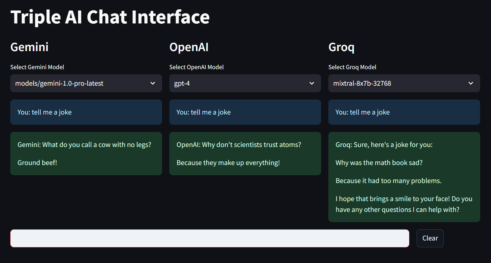

# Multi-AI Chat Interface

A Streamlit-based application that demonstrates concurrent interaction with multiple AI language models. This project was developed as part of my learning journey to understand modern AI APIs, real-time web applications, and Python development best practices.

 <!-- You can add a screenshot of your application here -->

## Project Overview

This application allows users to simultaneously interact with three different AI models:
- Google's Gemini
- OpenAI's GPT models
- Groq's LLM models

Each model runs in its own column with independent scrolling and message history, enabling real-time comparison of responses across different AI providers.

## Learning Objectives

This project helped me gain hands-on experience with:

1. **Modern AI APIs**
   - Integration with multiple AI providers (Google, OpenAI, Groq)
   - Handling API authentication and rate limiting
   - Managing asynchronous API responses

2. **Streamlit Framework**
   - Building interactive web applications
   - Real-time updates and state management
   - Custom styling and layout design
   - Component containerization

3. **Python Development**
   - Environment management with python-dotenv
   - API client libraries (google-generativeai, openai, groq)
   - Async/await patterns
   - Error handling and logging

4. **UI/UX Design**
   - Responsive layouts
   - Message containment and scrolling
   - Visual feedback and loading states
   - Cross-model interaction patterns

## Technical Implementation

### Key Features
- Three-column layout for simultaneous model interaction
- Independent scrollable chat containers
- Real-time message updates
- Model selection dropdowns
- Secure API key management
- Responsive design

### Libraries Used
- `streamlit`: Web application framework
- `google-generativeai`: Google's Gemini API client
- `openai`: OpenAI API client
- `groq`: Groq API client
- `python-dotenv`: Environment variable management
- `asyncio`: Asynchronous I/O handling

## Getting Started

1. Clone the repository:
   ```bash
   git clone https://github.com/yourusername/multi-ai-chat.git
   cd multi-ai-chat
   ```

2. Install dependencies:
   ```bash
   pip install -r requirements.txt
   ```

3. Set up environment variables:
   ```bash
   cp .env.example .env
   # Edit .env with your API keys
   ```

4. Run the application:
   ```bash
   streamlit run streamlit_app.py
   ```

## Environment Configuration

You'll need API keys from:
- [Google AI Studio](https://makersuite.google.com/app/apikey)
- [OpenAI Platform](https://platform.openai.com/api-keys)
- [Groq Console](https://console.groq.com/keys)

See `.env.example` for required environment variables.

## Lessons Learned

1. **API Integration Challenges**
   - Managing rate limits across providers
   - Handling different response formats
   - Implementing proper error handling

2. **UI/UX Considerations**
   - Importance of responsive design
   - Managing state across multiple chat windows
   - Providing clear visual feedback

3. **Development Best Practices**
   - Secure credential management
   - Code organization and modularity
   - Documentation importance

## Future Improvements

- [ ] Add conversation export functionality
- [ ] Implement conversation history persistence
- [ ] Add more granular model settings
- [ ] Enhance error handling and user feedback
- [ ] Add message threading capabilities

## Contributing

While this is a personal learning project, suggestions and feedback are welcome! Feel free to:
1. Fork the repository
2. Create a feature branch
3. Submit a pull request

## License

This project is licensed under the MIT License - see the [LICENSE](LICENSE) file for details.

## Acknowledgments

- Thanks to the Streamlit team for their excellent documentation
- The AI provider communities for their comprehensive APIs
- Various online tutorials and resources that helped in learning

---
*This project is part of my portfolio demonstrating practical experience with modern web development, AI integration, and Python programming.*
